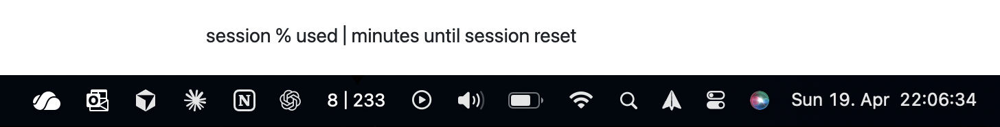

# Claude Usage Display

A [SwiftBar](https://swiftbar.app) plugin that shows your Claude.ai usage in your macOS menu bar.



Click to see the full breakdown and open your usage page:

```
Session (5h):  37%
Resets in 3h 53m
──────────────
Weekly (7d):   7%
Resets in 6d 18h
──────────────
Refresh
```

## How it works

Uses AppleScript to find a claude.ai tab in your browser and executes a small JavaScript snippet that makes an authenticated API call using your existing browser session. No API keys, no cookie extraction, no pip dependencies - just the Python 3 standard library.

The refresh works as follows:

1. **Tab hint** (every ~10s): The plugin remembers which browser tab worked last time. It runs the JavaScript snippet directly on that tab to fetch usage data from Claude's API. This is the common path.
2. **Full discovery** (when the hint fails): If the remembered tab no longer responds (e.g. Chrome suspended it), the plugin fetches all tab URLs across all browser windows, finds every claude.ai tab, and runs the JavaScript snippet on all of them in parallel. The first one to respond provides the usage data and becomes the new hint.

Inactive tabs work fine as long as Chrome hasn't suspended them. If all your claude.ai tabs are suspended, the plugin shows an error asking you to visit one to wake it up.

**Note:** This uses Claude.ai's internal API, which could change without notice.

## Setup

**Prerequisites:** macOS, Python 3.7+, [SwiftBar](https://swiftbar.app), a Claude.ai account (Pro/Team/Enterprise).

1. Install SwiftBar:
   ```bash
   brew install --cask swiftbar
   ```

2. Clone this repo:
   ```bash
   git clone https://github.com/PaulSchappert/claude-usage.git ~/claude-usage-bar
   ```

3. Make the plugin executable:
   ```bash
   chmod +x ~/claude-usage-bar/claude_usage.10s.py
   ```

4. Enable JavaScript from Apple Events in your browser:

   **Chrome/Chromium:** View → Developer → Allow JavaScript from Apple Events

   **Safari:** Develop → Allow JavaScript from Apple Events (enable the Develop menu in Safari → Settings → Advanced first)

5. Create a dedicated plugin folder containing only a symlink to the script (SwiftBar treats every file in its plugin folder as a plugin, so pointing it at the repo makes LICENSE/README show up as error icons):
   ```bash
   mkdir -p ~/.swiftbar-plugins
   ln -sf ~/claude-usage-bar/claude_usage.10s.py ~/.swiftbar-plugins/claude_usage.10s.py
   ```

6. Open SwiftBar and set the plugin directory to `~/.swiftbar-plugins`.

7. Start SwiftBar automatically at login so the menu bar item is always there. Either enable **Launch at Login** in SwiftBar's preferences, or run:
   ```bash
   osascript -e 'tell application "System Events" to make login item at end with properties {path:"/Applications/SwiftBar.app", hidden:true}'
   ```

That's it. Keep a claude.ai tab open somewhere in your browser (it doesn't need to be the active tab) and your usage will appear in the menu bar.

## Configuration

| What | How |
|------|-----|
| Refresh interval | Rename the file - the `10s` in `claude_usage.10s.py` controls it (e.g., `30s`, `1m`, `5m`) |
| Debug mode | `CLAUDE_USAGE_DEBUG=1 python3 claude_usage.10s.py` - dumps raw API response |

## Troubleshooting

| Symptom | Fix |
|---------|-----|
| "Claude ⚠" - all tabs suspended | Visit any claude.ai tab in your browser to wake it up |
| "Claude ⚠" - no tab found | Open a claude.ai tab in your browser |
| "Claude ⚠" - JS error | Enable JavaScript from Apple Events in your browser (step 4) |
| Nothing in menu bar | Make sure SwiftBar is running (`open -a SwiftBar`) and pointed at the right plugin folder. Enable Launch at Login (setup step 7) so it survives restarts |
| SwiftBar error icon | Your plugin folder contains non-plugin files. Use a dedicated folder with only a symlink to the script (setup step 5) — disabling files in SwiftBar is not enough, "Refresh all" still runs them |
| Numbers look stale | Click the dropdown → Refresh |

## Supported browsers

Chrome, Brave, Arc, Edge, Vivaldi, Chromium, Safari.

## License

MIT

---

## Agent installation guide

The following instructions are for AI coding agents setting up this plugin on a user's machine.

### Prerequisites check

```bash
# Check macOS
[[ "$(uname)" == "Darwin" ]] && echo "OK: macOS" || echo "FAIL: macOS required"

# Check Python 3
python3 --version

# Check SwiftBar
brew list --cask swiftbar 2>/dev/null && echo "OK: SwiftBar installed" || echo "NEED: brew install --cask swiftbar"
```

### Installation

```bash
# 1. Install SwiftBar if needed
brew install --cask swiftbar

# 2. Clone the repo
git clone https://github.com/PaulSchappert/claude-usage.git ~/claude-usage-bar

# 3. Make plugin executable and create a dedicated plugin folder with only a symlink
#    (never point SwiftBar at the repo itself — it runs every file as a plugin)
chmod +x ~/claude-usage-bar/claude_usage.10s.py
mkdir -p ~/.swiftbar-plugins
ln -sf ~/claude-usage-bar/claude_usage.10s.py ~/.swiftbar-plugins/claude_usage.10s.py

# 4. Set SwiftBar plugin directory (user must do this manually in SwiftBar UI,
#    or: defaults write com.ameba.SwiftBar PluginDirectory "$HOME/.swiftbar-plugins" && killall SwiftBar; open -a SwiftBar)
# Tell the user: Open SwiftBar → set plugin folder to ~/.swiftbar-plugins

# 5. Enable JavaScript from Apple Events (user must do this manually)
# Tell the user: Chrome → View → Developer → Allow JavaScript from Apple Events

# 6. Start SwiftBar at login so the menu bar item survives restarts
osascript -e 'tell application "System Events" to make login item at end with properties {path:"/Applications/SwiftBar.app", hidden:true}'
```

### Verification

```bash
# Test the plugin directly
python3 ~/claude-usage-bar/claude_usage.10s.py

# Expected output (success): "NN │ NNN" followed by dropdown lines
# Expected output (no tab):  "Claude ⚠" followed by an error message
```

### Files

- `claude_usage.10s.py` - the SwiftBar plugin (10s refresh interval)
- `~/.claude-usage-tab-hint.json` - cached tab location for fast refresh (auto-created, not in repo)

### Notes

- The plugin requires a claude.ai tab to be open in a supported browser. It does not need to be the active tab - inactive tabs work as long as Chrome hasn't suspended them.
- The `.10s` in the filename controls the refresh interval. Rename to change (e.g., `.30s`, `.1m`).
- SwiftBar treats all executable files in the plugin directory as plugins. Ensure only `claude_usage.10s.py` is executable.
